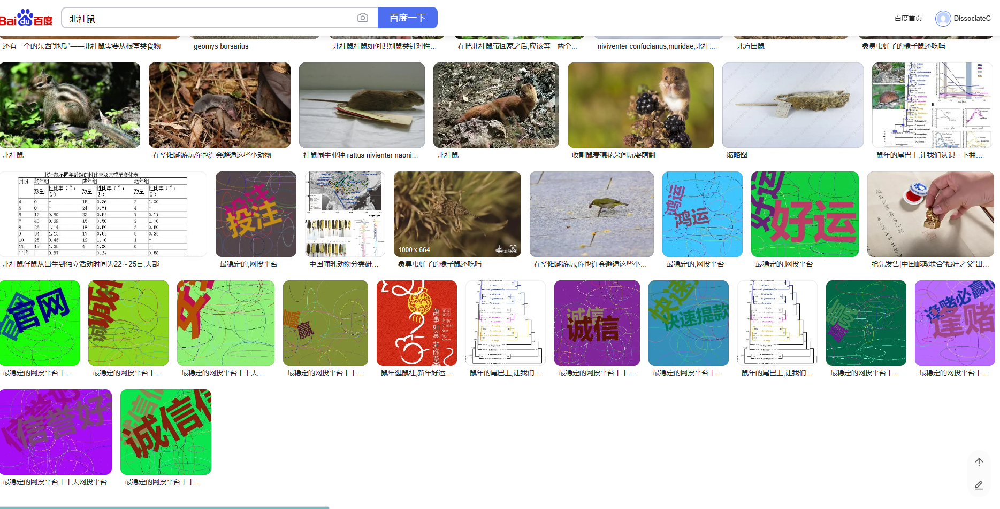
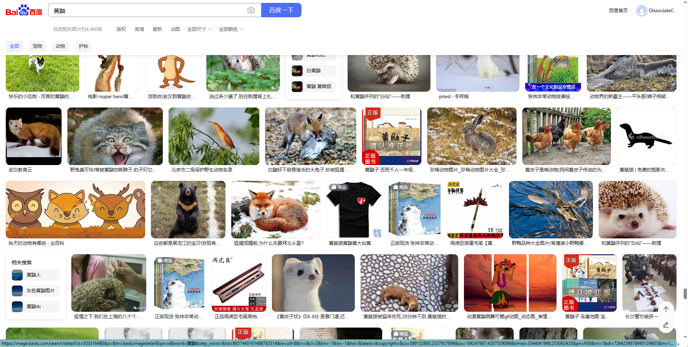
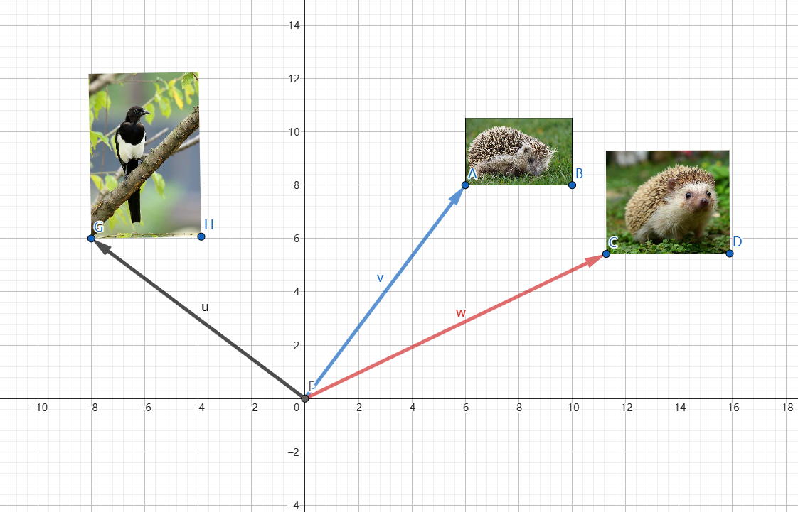

# 奇技淫巧 —— 图片数据筛选

**本文采集数据集的方法**:   
`数据采集工具`: 八爪鱼（原程序 `百度图片搜索.otd`，导入自己的八爪鱼应用可以直接用）     
`采集类别`: 见 `南山鸟类及哺乳动物.xlsx`

**问题所在**:   
我们自己在网上收集的图片质量残次不齐，所以需要对我们收集的数据进行清洗（剔除无关数据、不可读取的数据等）。

例如（我在百度图片搜素的），奇奇怪怪的一大堆：

**为减少人力成本，思路如下**:
1. 核心思想：`将所有图片抽象理解为在高维坐标系中的某一个点以及相对于原点的向量`
2. 爬取所需 $N$ 张图片，将图片集合记作 $U$
3. 从 $U$ 中人工确定图片集合 $SureImage$ ，共$K$张（$K << N$，每个类别确定不少于5张图片），当然越多越好，但是越多越违背减少人力的初衷。
4. 确定较强表征能力的模型 $M$
5. 使用 $M$ 抽取 $SureImage$ 的特征为 $SureVector$，其维度为$(K, D)$
6. 使用 $M$ 抽取 $U \setminus SureImage$ 抽取特征为 $FlawVector$，其维度为$(M, D)$，其中$M = N - K$
7. 求 $SureVector$ 和 $FlawVector$ 之间的夹角 $\theta$。当$\theta \to 0$时，$SureVector$ 和 $FlawVector$ 为同向，即所对应的图片为相同类别；当$\theta \to \pi$ 或 $\theta \to -\pi$ 时，$SureVector$ 和 $FlawVector$ 为反向，即所对应的图片关系不大。
8. 求出向量求夹角公式 $\cos\theta = \frac{SureVector \cdot FlawVector}{||SureVector||*||FlawVector||}$，当$\cos\theta \to 1$时，$\theta \to 0$；当$\cos\theta \to -1$时, $\left|\theta \right| \to \pi$
9. 设置特定阈值规则从而筛选可靠图片

如图所示，将图片抽象理解为二维坐标系中的一个点（图片的左下角点）。图片 $AB$ 在经过模型 $M$  后会得到向量 $\vec{v}$，同理可以将 $CD$、$GH$分别得到 $\vec{w}$、$\vec{u}$。    
设置特定阈值 $\gamma$, 求 $\vec{v}$ 与 $\vec{w}$ 的夹角 $\cos\theta=\frac{\vec{v} \cdot \vec{w}}{||\vec{v}|| * ||\vec{w}||}$，如果$\cos\theta < \gamma$，则将其确定为同一类别。

现假设 $\vec{v} \subset SureVector$ 和 $\vec{u},\vec{w} \subset FlawVector$。$\vec{v}$ 和 $\vec{w}$之间的$\cos\theta < \gamma$，那么$CD$是类似图片，可以将其保留；$\vec{v}$ 和 $\vec{u}$之间的$\cos\theta > \gamma$，那么$GH$是不相关的图片，将其丢弃。

**Code:** `data_filter.ipynb` 仅供参考。