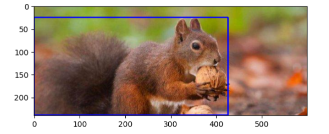
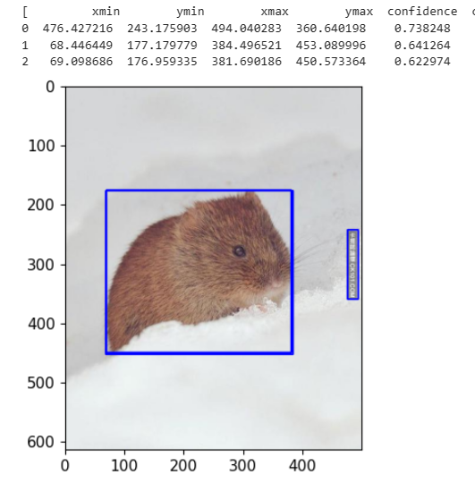

# 奇技淫巧 —— 图片目标框标定

**代码实现**: `detect_bbox.ipynb`，只在特定环境下运行，所以仅供参考。

**数据来源**:   
所有数据源自 `数据筛选` 部分得到的筛选后的数据，之所以使用筛选后的数据是为了减少后续图片出现争议的情况。

**问题所在**: 数据标注一直是一件劳民伤财还费时的事情。

**为缓解上述问题，思路如下**:
1. 获取数据筛选后的图片（类别名称文件夹对应各个类别的图片），例：
```
image_path
    - 狗
        - 1.jpg
        - 2.jpg
    - 猫
        - 1.png
        - 3.jpeg
    ...
```
2. 选定一个 Grounding 的强模型
3. 使用文件夹的名称（若为中文，则将其转为英文学名）作为 Prompt，推理出检测框
4. 使用文件夹的名称作为类别号，最后生成COCO格式的目标文件

## 模型选择
### GroundingDINO
GroundingDINO 可以根据文字描述来检测图片中的指定目标，在配合Stable Diffusion后更可以完成修改图片内容的操作。所以 GroundingDINO 可以根据我们提供的动物学名而去找到动物本身，而且过滤掉非动物的物体。


## YOLOv5的劣势
**YOLOv5使用 yolov5l6.pt 预训练权重**

如果我们使用 YOLOv5 的 COCO 预训练权重，其在针对鸟类（例如白鹭、黑脸噪鹛等）可以都将其归为`bird`类，因为他们都属于鸟这个类别。但当我们出现一些在COCO之外或者说不那么类似的类别时，COCO输出的类别并不可信，例：


YOLOv5预测的类别是`bear`，所以我使用文件夹的名称作为类别号。

**现在就有个问题**: 如我无脑将所有框都使用文件夹的名称，如果图片中突然出现个其他东西，我该怎么知道这个框该不该要呢  
例子：


就像图中的 `松鼠` 是我们需要的，但是他手中的 `核桃` 是不需要的。

**你可能会说**： 可以使用YOLOv5的标签映射，将所有的 `bear` 映射成 `野猪` 的标签

例子：


可以看到YOLOv5还将野猪识别成了 `cow`。你难道要把YOLOv5和你所需识别的标签全部以N对1的形式映射吗，你根本不知道YOLOv5会将你的某一个类别识别成哪N个类别。如果你真的要去寻找这个N，那人力成本也是不小的。

## GroundingDINO优势
### 对比示例图
在两张同样的图片中：上图是YOLOv5结果，下图是GroundingDINO的结果（提示词为图片原类名的英文学名，例：Prompt = "Red-bellied Squirrel"）







