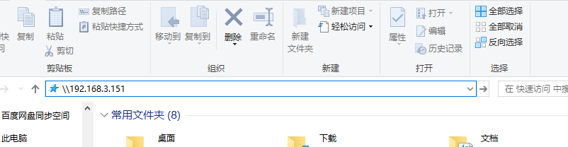
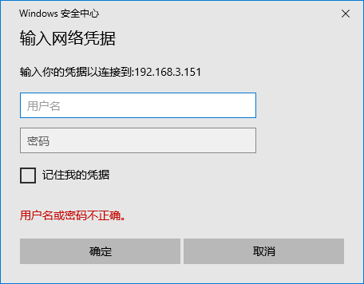
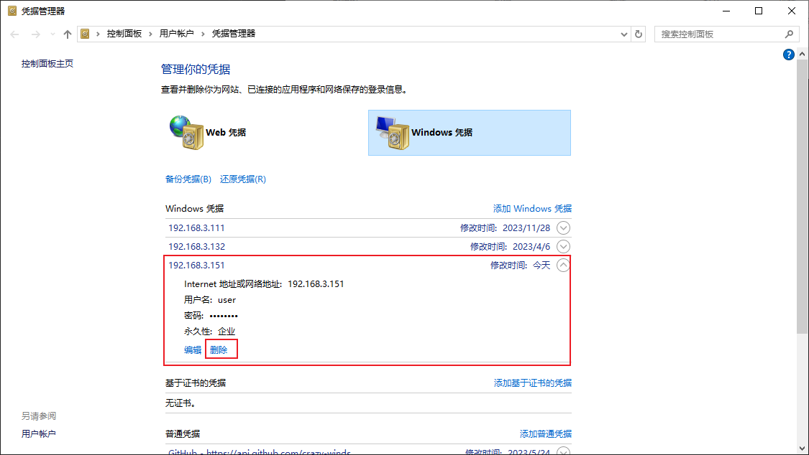
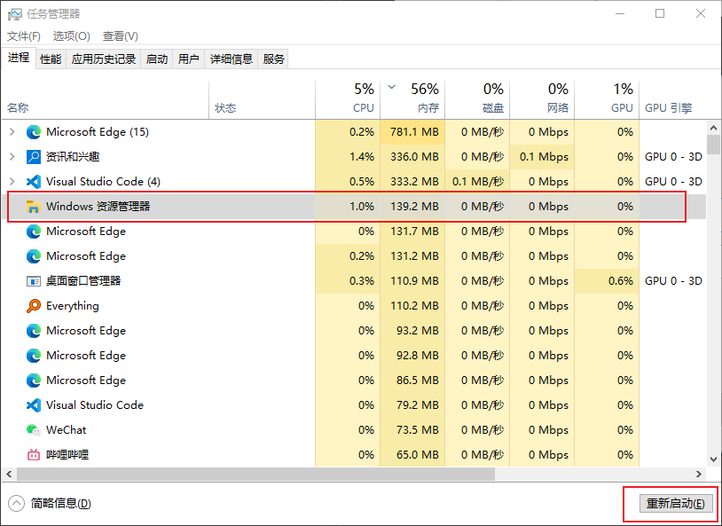

# Windwos 共享（SMB）连接

1. 进入 `文件资源管理器`, 在输入框输入 `\\[IP]`（例：`\\192.168.3.151`），Enter （回车）

2. 进入 windows 凭据登录界面，输入用户名： `user`，密码： `dsmy123456`，登录即可

# 附录

## 登录过之前账户，需要切换用户

1. 打开 `设置`，搜索 `windows凭据`
2. 进入 `凭据管理`，删除所对应 IP 账户
3. 重新登录

## 用户名密码错误，需要等待较长响应时间

1. 打开 `任务管理器`
2. 重新启动 `文件资源管理器`
3. 卡顿片刻，重新登录

