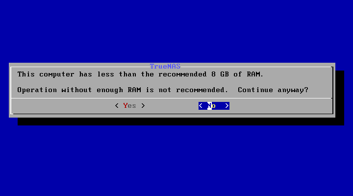

# 虚拟机安装 FreeNas

## 下载 ISO
进入官网 [FreeNas](https://www.truenas.com/freenas/) 选择 `Get TrueNas` -> `Download TrueNas Core`，进入页面下载ISO。

TrueNas 和 FreeNas 是共享了大量的代码的，可以简单理解为同一个东西。TrueNas Core 为开源版本，TrueNas Enterprise 为商用版本。

我现在下载得到的是 `TrueNAS-13.0-U6.1.iso`

## 创建虚拟机 (可选)
创建虚拟机，不清楚可以搜素 VMware 如何创建虚拟机

创建完成后记得选择刚刚下载的镜像

## 安装
1. 开机，进入界面，按数字键 `1` 进入安装界面

2. 选择 `install` -> `OK`

3. 提示电脑内存低于8GB，可以退出调大虚拟机内存，可以直接继续，我这里选择继续

4. 选择 Nas 系统所要安装在哪一块磁盘上，这个自行决定吧，使用 `空格` 键来选择硬盘

5. 警告：这将会清除这块硬盘的所有数据和分区，并且他不能作为共享数据的硬盘。

6. 设置密码

7. 选择启动模式，我选择了 `BIOS`， [UEFI和BIOS区别](https://zhuanlan.zhihu.com/p/436122944)。因为我只给了块 20G 的硬盘，所以不会显示需要创建 swap 分区。

等待安装 ...

之后会提醒重启

