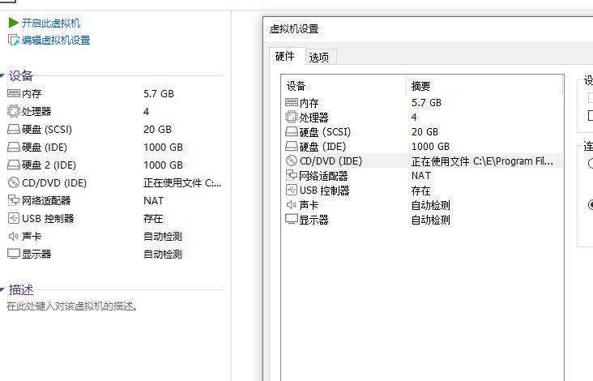
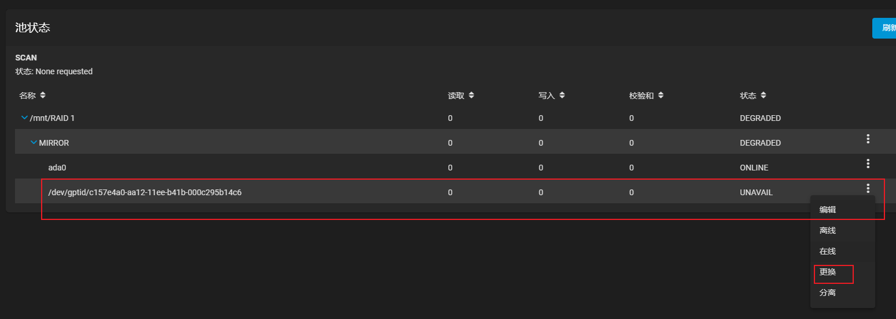

# RAID 1

不同的 RAID 具有不同的数据冗余性和数据读写速率，根据自己的需求去做相应的事

[不同 RAID 的含义](https://www.cnblogs.com/python-learn/p/16392009.html)

## 添加硬盘
假设：我买了两块 1T 的硬盘（如果是虚拟机，硬盘格式需要选择 `IDE` 而不是 `SCSI`，`SCSI`是没有磁盘序列号的，到时候会报警告），将其插在我的 PC 上，我想将这两块硬盘做 RAID 1

## RAID 1 配置
打开浏览器，输入 nas 界面显示的 IP，访问到 TrueNas 的登录界面。用户名：`root`，密码：自行配置的（可以在命令行界面进行重置）。

可选操作，如果不习惯英文界面：`System` -> `General` -> `Language` -> `Simplified Chinese`，点击 `Save` 即可变为中文

### 创建RAID池
1. 添加池

2. 将磁盘添加入池，并选择镜像格式，而不是条带

3. 在创建的池下创建数据集

4. 创建用户

5. 创建 SMB 共享： `共享` -> `Windows(共享)` -> `添加` -> 选择数据集或者池都可以，我是作为所有人共享使用，所以选择数据集 -> 如果选择数据集，这时会需要配置 ACL，按需求配置就好，共享就直接管理员权限了

6. windows 访问

## 模拟硬盘损坏
1. 假设我在 nas 中存储了数据

2. 我们直接暴力拔硬盘，模拟硬盘损坏

3. 开机后查看 RAID 1 这个池，可以看到已经掉了一块盘了

4. 这时去访问数据，数据还是存在的

## 修复损坏
现在我们已经发现有一块硬盘损坏，这时我们需要去更换硬盘

1. 买块硬盘，插回去 （虚拟机重新添加一块 `IDE` 的硬盘）

2. 找到损坏的池，点击`状态`

3. 找到损坏的硬盘，点击 `更换`

4. 更换完成，显示记录（刷新后消失）
