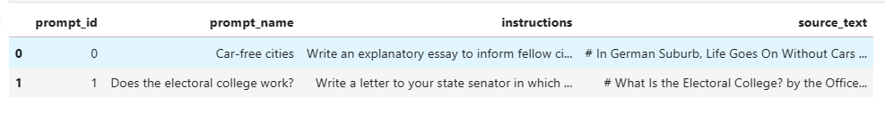

# Generate with Mistral-7B Instruct

[Kaggle LLM Detect AI Generated 代码参考](https://www.kaggle.com/code/phanisrikanth/generate-synthetic-essays-with-mistral-7b-instruct)

## 前置知识

**chat templates:** 一种统一各大 LLM 调用 API 的模板格式。[HuggingFace ChatTemplates 解释](https://huggingface.co/docs/transformers/main/en/chat_templating#how-do-i-use-chat-templates)

**user:** 我向 LLM 提出的问题或需求

**assistant:** LLM 的回复

## 使用 ChatTemplates

我们使用模板来配置一个问题 `What do you think of the Chinese New Year ?`

``` python
import torch
from transformers import AutoModelForCausalLM, AutoTokenizer

device = "cuda"
tokenizer = AutoTokenizer.from_pretrained("./Mistral-7B-Instruct-v0.2/")
model = AutoModelForCausalLM.from_pretrained(           # Mistral 需要大约16G显存
    "./Mistral-7B-Instruct-v0.2/",
    torch_dtype=torch.bfloat16,
    device_map="auto",
)
messages = [
    {"role": "user", "content": "What do you think of the Chinese New Year ?"},
]
token_chat = tokenizer.apply_chat_template(
    messages,
    tokenize=True,
    add_generation_prompt=True,
    return_tensors="pt"
).to(device)

output = model.generate(
    token_chat,
    pad_token_id=tokenizer.eos_token_id,
    max_new_tokens=1000,
)

tokenizer.decode(output[0])
```

Out :

``` shell
>>> "<s> [INST] What do you think of the Chinese New Year ? [/INST] Chinese New Year is a significant and ..."
```

## 使用比赛提供的 Prompt 来生成数据集

[Kaggle 赛题数据](https://www.kaggle.com/competitions/llm-detect-ai-generated-text/data?select=train_prompts.csv)

观察数据获取 `prompt_name` 和 `instructions` 做为生成指令的一部分



自行构建一个指令模板（模板参考 Kaggle 代码），`{0}`: 填写文章所需要的字数；`{1}`：填写 `prompt_name`；`{2}`:填写 `instructions`。

```python
prompt_template = """
You are a student working on the following assignment.

Write an essay based on the following topics and backgrounds with a word count of about {0}.

Topic: "{1}"

Backgrounds: "{2}"

"""
```

将 `prompt_template` 填入 `content` 中，交给 Mistral 让其生成

```python
messages = [{"role": "user", "content": prompt_template}]
```

**完整代码**: `mistral_generated.ipynb`

