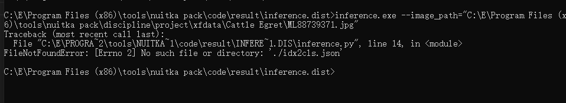
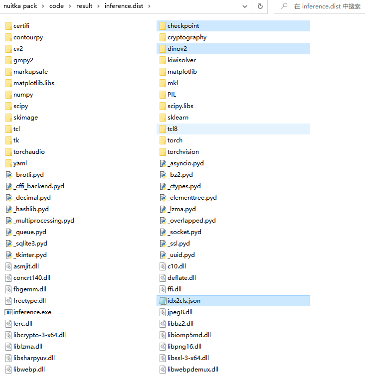
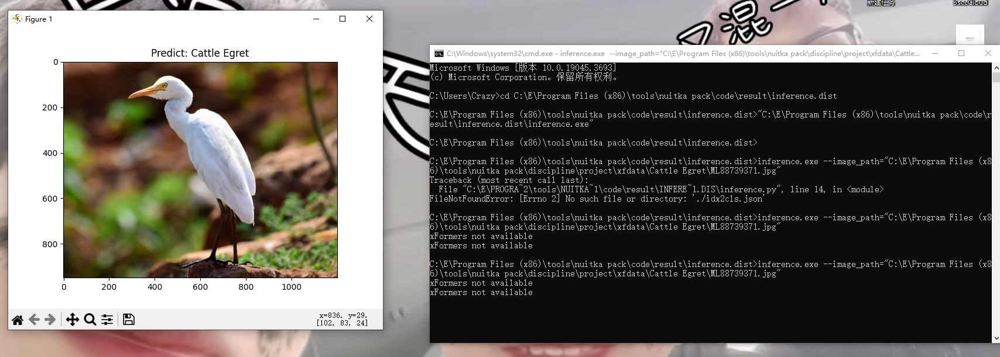
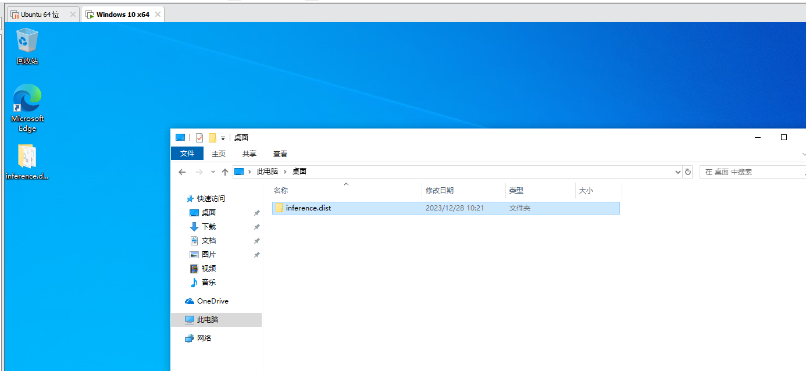
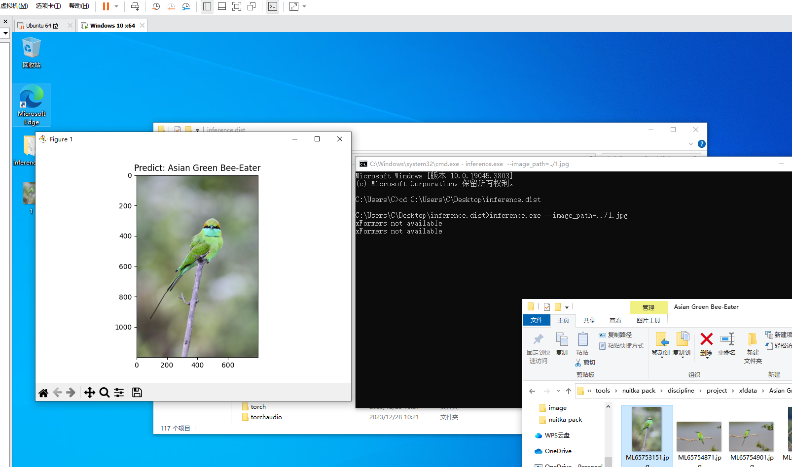

# Python打包 —— Nuitka

全文针对 Windows 进行打包

## Nuitka 准备
nuitka 是一个python的打包工具，他将pyhton编译为C或CPP代码，最终生成一个可执行文件
### C 的编译器
可以选择 `MinGW64` 或 `Visual Studio`，如果要查看版本信息见 [pypi 中nuitka对C的解释器版本的要求](https://pypi.org/project/Nuitka/)。安装教程可以自行使用搜索引擎。

## 项目介绍
作为示例，可以随便选取一个深度学习项目，这里选取的是一个深度学习比赛的代码 [讯飞-鸟类品种识别挑战赛](https://challenge.xfyun.cn/topic/info?type=bird-species&option=ssgy&ch=ijcX54b)，仅使用他作为示例深度学习项目。

**简略说明代码**：这是一个鸟类图像分类的比赛，使用DINOv2来进行图像分类 [代码](https://github.com/crazy-winds/CompetitionExperience/tree/main?tab=readme-ov-file#%E8%AE%AF%E9%A3%9E---%E9%B8%9F%E7%B1%BB%E5%93%81%E7%A7%8D%E8%AF%86%E5%88%AB%E6%8C%91%E6%88%98%E8%B5%9B)（阿里云盘不让共享压缩包，解压后不让上传太多文件；百度网盘需要会员才能上传大文件，所以只提供了代码）。最终将其打包为可执行文件，输入图片运行，可视化图片，并在标题显示输出结果。

### 环境安装
因为没有GPU，所以安装了CPU版本
``` shell
conda create -n nuitka python=3.10
conda activate nuitka
# CPU
conda install pytorch torchvision torchaudio cpuonly -c pytorch

pip install albumentations
pip install matplotlib
pip install nuitka
```

### 运行代码介绍
1. 前置准备，标签映射
``` python
with open("./idx2cls.json", "r") as f:
    idx2cls = json.load(f)
```

2. 在打包后可以使用命令行参数来作为输入
``` python
parser = argparse.ArgumentParser()
parser.add_argument('--image_path', type=str, default="", required=True, help="图片路径，例 123.jpg")
parser.add_argument('--device', type=str, default=None, help="推理设备，例 cpu, cuda")
args = parser.parse_args()
device = args.device
ROOT_PATH = args.image_path

if device is None:
    device = "cuda" if torch.cuda.is_available() else "cpu"
```

3. 输入图片预处理
``` python
transform = A.Compose([
    A.SmallestMaxSize(max_size=IMAGE_SIZE),
    A.CenterCrop(IMAGE_SIZE, IMAGE_SIZE),
    A.Normalize(),
    ToTensorV2()
])

img = np.array(Image.open(ROOT_PATH).convert("RGB"))
if transform is not None:
    img = transform(image=img)["image"]
```

4. 初始化网络模型
``` python
model = modules.ConvNext(25, False)
model.load_state_dict(torch.load("./checkpoint/99866.pt", "cpu")["model"])
model.eval()
model.to(device)
```

5. 模型推理
``` python
with torch.no_grad():
    x = img.to(device).unsqueeze(0)
    out = model(x)
    logit = out.argmax(-1).cpu()
```

6. 使用 matplotlib 可视化结果
``` python
plt.imshow(Image.open(ROOT_PATH).convert("RGB"))
plt.title(f"Predict: {idx2cls[str(logit.item())]}")
plt.show()
```

## Nuitka 打包
[Nuitka 中文文档](https://daobook.github.io/nuitka-doc/zh_CN/user-manual.html)
```shell
python -m nuitka --standalone --show-progress --show-memory --enable-plugin=matplotlib,tk-inter --output-dir=result inference.py
```

需要等待一段漫长的时间，运行后会呈现四个状态（特别吃内存）
1. PASS 1
2. PASS 2
3. C Source Generation
4. Backend C

随后会在 `./result/` 目录会有如下结构
```
├─inference.build
│  └─static_src
└─inference.dist
    ├─inference.exe
    ├─cv2
    ...
```

在 `inference.dist/` 中会存在一个 `inference.exe`，这就是生成的可执行文件

直接运行后会出现错误



这时就需要将那些依赖文件复制进 `inference.dist/`中，(`checkpoint/`，`dinov2/`，`idx2cls.json`)



因为代码中使用的是相对路径，所以也要进入 `inference.dist/` 目录下运行，可以把 `inference.exe` 直接理解为 `python inference.py`
``` shell
# python inference.py --image_path="ML88739371.jpg"
inference.exe --image_path="ML88739371.jpg" 
```
执行结果



### 迁移验证
在原机器上验证可能没什么问题，可到了别的机器就可能出现问题了，所以将 `inference.dist/` 目录拷贝至其他机器，以模拟我需要使用的场景。

我并没有多余的测试机器，所以使用 `VMware` 创建一台全新的 Windows 10 虚拟机来测试（`VMware` 安装和破解网上都是有相应教程的，如果机器内存低于8G，建议还是另找测试机，不然本机和虚拟机都可能吃不消）。

[Windows 10 ISO镜像下载地址](https://www.microsoft.com/zh-cn/software-download/windows10)，将工具包下载下来，选择ISO，然后保存在本地即可。网上 `VMware` 安装虚拟机的教程也是很多，这里就不再展开（要学会熟练使用搜素引擎）。

**安装 Windows 10 记得断网安装，否则他会要求你登录微软账户**

虚拟机和实体机直接互相使用复制粘贴，请安装 `VMware Tools`，参照网上教程。

在做完这些工作后，直接将 `inference.dist/` 目录拖至 Windows 10 虚拟机中



随后运行一样的命令，执行成功（收工）



### 参数介绍
查看所有参数及简介
``` shell
python -m nuitka --help
```
查看 nuitka 支持的插件
```shell
python -m nuitka --plugin-list
```

命令解析
```shell
--standalone                        # 打包后使可执行程序可脱离python环境
--show-progress                     # 显示进度条信息
--show-memory                       # 显示使用内存信息
--enable-plugin=matplotlib,tk-inter # 使用 matplotlib 和 tk 插件，因为代码中使用了 matplotlib 去可视化结果，而matplotlib的后端又是 TkAgg 所以需要这两个插件的支持
--output-dir=result                 # 所输出文件夹所在的路径
```

如想查看一些用例可以自行网上查找


**源码连接：** https://www.alipan.com/s/dRF5aJrMV5G， 提取码: 48fo